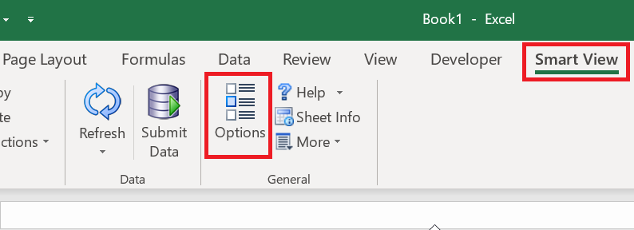
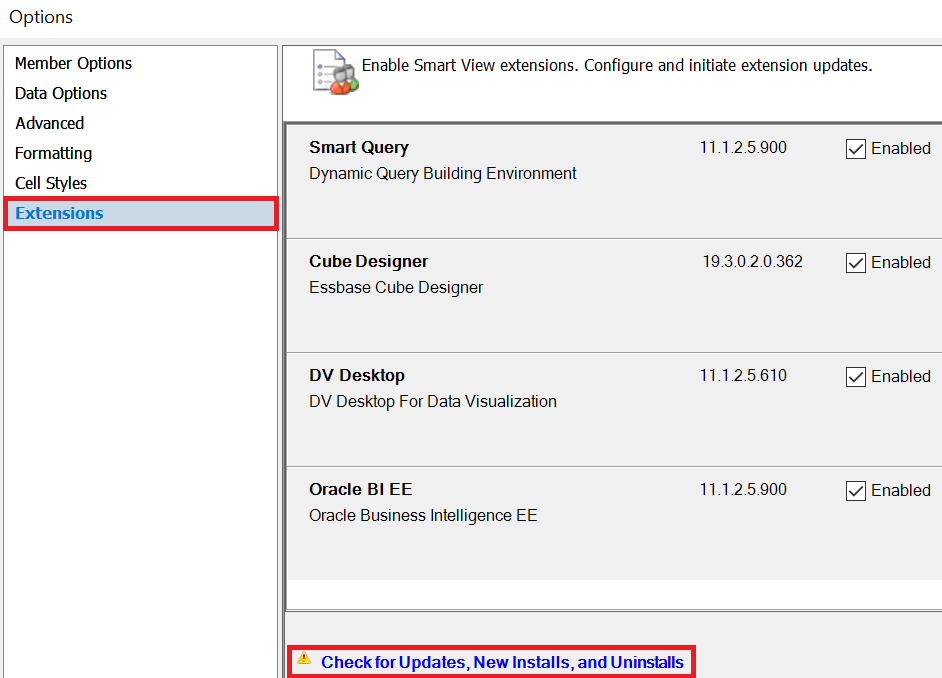
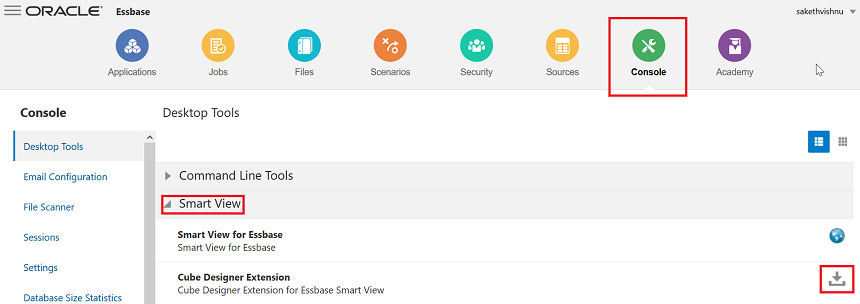
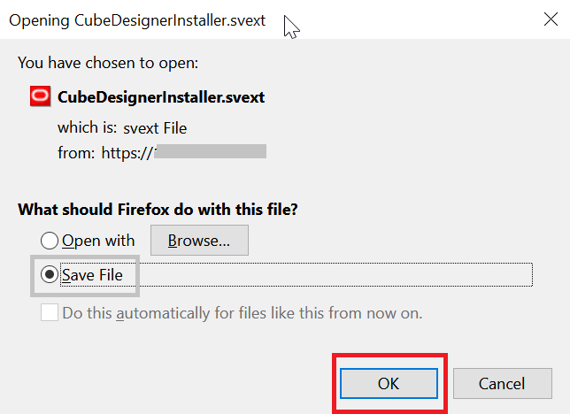
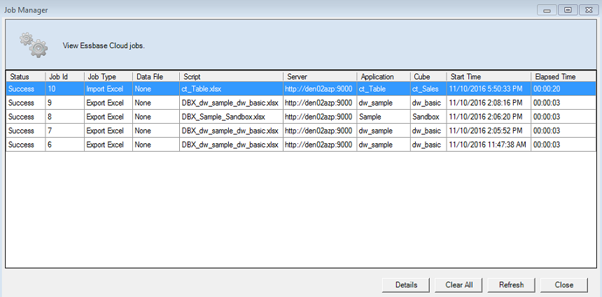

# Lab 14: Essbase Feature Functionalities

## Objectives -

* Connecting to Data Sources

* Describe Smart View user interface

* Create ad hoc grids

## Part 1 - Analyzing Essbase data using Smart View Plugin

### Step 1 - Connecting to Data Sources

After installing Oracle Smart View for Office, you can create connections to Essbase in cloud.
Connections require information about the server and port. Your cloud service
administrator should provide you with the information you need to create the
connection. Use the quick connection method to create a private connection to the
cloud service.

To create a private connection using the quick connection method:

1. In Excel, select the Smart View ribbon, and then click Panel.

2. On the Smart View Panel, click the arrow on the Switch to button, and then select Private Connections from the list.

3. In the text box that opens, enter the URL for the data source to which you want to connect.

The URL syntax: ``https://server/essbase/smartview``

4. Click Go, or press Enter. (You will receive alert for certificate error. This is expected behavior as for the purpose of this tutorial we are using Essbase 19c deployment with demo certificate. Once in post deployment / production instance we replace demo certificate with paid SSL certificate we will not get this alert. For instance, click yes on alert to continue with lab exercise.)

5. On the login window, enter your login credentials

After successful login, you can now begin working with data in Oracle Analytics Cloud - Essbase. 

5. Expand ‘EssbaseCluster’, navigate to ‘DynamicCorp’ application. Double click on ‘Sales’ database.

You will be presented with option to create Ad hoc grid. Click on Ad hoc analysis.

Smart View: Excel User Interface

Smart View Ribbon

The Smart View ribbon option enables you to set Smart View options and perform commands that are common for all data source providers.

Essbase Ribbon

The Essbase ribbon contains commands that enable you to view, navigate, and analyze Essbase data.

POV Toolbar

Dimensions that are not displayed in columns or rows of a data grid are displayed on POV toolbar, which identifies a slice of the database for a grid. For default ad hoc grids, all database dimensions are displayed on the POV toolbar at the dimension level

Smart View Panel 

You use Smart View panel to connect to your smart view data sources and manage connections.

Ad hoc Analysis using Smart View 
1. Bring up Excel. Click Smart View – Panel – Private Connections. Enter the provided Smart View URL. Supply the credentials.

2. In the Connection Manager panel to your right, click ‘DynamicCorp’ – ‘Sales’. Click Connect. Click Ad hoc Analysis. 

3. After connecting to an Essbase server and opening a worksheet, you can initiate ad hoc reports against databases on the connected server. A report initiated at the database level on an empty worksheet returns data from the top levels of each database dimension.

4. Double click or zoom in to Measures and Year. You will now see the measures broken down by Quarters.

5.Go to Year. Click on Zoom In – All levels. You will now see the numbers broken down to leaf level Months. ‘Zoom in’ drills down to display details.

To zoom in on a member, perform one of the following actions:

* Select the member and then, on the Essbase ribbon, click Zoom In.
* Double-click the member.

Double Click (or Click Zoom in): Measures – Profit – Margins – Sales. Go to Sales. Click Keep Only. Now you are analyzing only Sales numbers and you have removed the rest from your sheet. 

In the Smart View ribbon click Undo. Undo reverses the last change you made to the data. 

In the Smart View ribbon click ‘Redo’. It will take you back to the sheet prior to the ‘Undo’. 

Pivot to POV: Click on ‘POV’ in ‘Essbase’ ribbon. 

Click on down arrow next to Market. Select New York. 

You can now select New York in the POV toolbar, click Refresh to see the figures refreshed in the sheet for New York. 

Member Selection: Drag Scenario from POV tool bar to the sheet.  

Click on Scenario

Click on Member Selection in the Essbase ribbon. Select Actual.

Free Form processing: You can free form type a member combination on a sheet. Click Refresh. The sheet will be updated to show the results of the query in your free form sheet. 

Start with creating smartview analysis report.

Create report by zooming into Year & Measures dimension.

You can directly enter Sales account member in place of Profit to visualize sales data across year without needing to perform member selection.

Click on Profit cell and replace with Sales, hit refresh.
 
Audit Trail
Enable Audit trail: 
Data is updated in Essbase by Submitting data, adding/changing LRO (Linked Reporting Objects) and Data load. Essbase has the capability to let certain users go back and view the Audit Trail of the changes that were made to the data. 
Users who have one of the following roles on the application can view the processed audit records for the cubes in that application: Application Manager, Database manager, Database Update role. Only those records where the user name requesting the audit trail matches the user name registered in the audit records, will be returned. 

Enable Audit Trail 

1. The Service Administrator and Power User have the permissions to enable Audit Trail in the Essbase Application. 

2. Log in to Essbase UI. Click on Application DynamicCorp. Click on hamburger icon. Click on inspect.	 	
 
3.Click on configuration.

4. Click on Add + to your right.

5.Click + to select ‘AUDITTRAIL’ property.  Enter ‘DATA’ in value field. Click ‘Apply and Restart’ to restart application. 

Exercise 1-2	Submit Data and Audit Trail

1. Log in to Smart View and connect to application DynamicCorp/Sales. Click on Connect. Click on Ad hoc Analysis. 

2. Click on Year. Click on Zoom In – All levels. 

3. Change data for Jan. Click ‘Smart View’ – ‘Submit Data’

4. Click ‘More’ under ‘Ad hoc Analysis’. Click on ‘Audit Trail’.
	 
5. Notice an Audit Trail table that contains records of changes made to the cube. The record contains Timestamp, New Value, Data cell POV where change was made. 

Below the table, notice a detailed description of the change in the Audit record. 

Exercise 1-3	Linked Reporting Objects and Audit Trail

1.	Click on cell cell B3. Click ‘Essbase’ – ‘Linked Objects’. Click drop down next to ‘Attach’. Click ‘Cell Note’. Add a cell note "Figures are too high".

2.	Click on cell B7. Click ‘Essbase’ – ‘Linked Objects’. Click drop down next to ‘Attach’. Click ‘File’. Browse and attach a file. Enter a file description. 

3.	Click on cell B11. ‘Essbase’ – ‘Linked Objects’. Click drop down next to ‘Attach’. Click ‘URL’. Enter URL http://cnn.com and enter "Breaking news!". Make a few more such updates. 

4.	Click ‘Audit Trail’ menu. You will see the table populated with all the changes you made. Each record in the audit trail represents one of two changes - change to data (New Value) or change to LRO (LRO)
 
Exercise 1-4	Audit Trail Table 
1.	There are three icons at the bottom of the audit table: "Export logs to sheet", "Refresh audit log list", "Adhoc for selected POV. The columns in the Audit trail table can be sorted by clicking the arrow at the heading. 
			 
2.	Audit records can be exported to an excel file by clicking on icon at the bottom of Audit table called "Export logs to sheet". 
 
3.	When you click on an audit record, you can see the description of the audit record change in the description section at the bottom of the table.
 
4.	Then, if you want to do further analysis on the POV for this record, select the icon at the bottom of the Audit table titled "Adhoc for selected POV", it will land you on a sheet called "Audit_adhoc", with the POV and refreshed data value. This is the starting point and it is a live sheet where you can start doing analysis and rest of Smart View operations.  
 
5.	This is a shared sheet for landing from Audit record. When you click on subsequent audit records, and click on Adhoc for selected POV, it will land you in this same sheet.

## Install the Smart View Cube Designer Extension

Before you perform this procedure, you must complete the steps in Create Data Source Connections to Essbase. 

### Installing Cube Designer from Smart View

1.	On the ‘Smart View’ ribbon, select ‘Options’, and then ‘Extensions’. 

2.	Click the ‘Check for updates’ link. 
Smart View checks for all extensions that your administrator has made available to you. 

3.	Locate the extension named Oracle ‘Cube Designer’ and click ‘Install’ to start the installer. 

4.	Follow the prompts to install the extension.

### Installing Cube Designer from Essbase
1.	In Essbase19c UI , click ‘Console’.

2.	On the ‘Desktop Tools’ tab, to the right of Cube Designer Extension, click ‘Download’ . 

  
3.	In the ‘CubeDesignerInstaller.svext’ dialog box, select ‘Save File’ and click ‘OK’. 

Save the file to a local directory.

4.	Close all Microsoft Office applications and make sure Microsoft Office applications are not running in the background.

5.	Double click the ‘CubeDesignerInstaller.svext’ file we downloaded to local directory.

6.	Restart Microsoft Office applications.

### Update the Smart View Cube Designer Extension

If an extension is available for you to update, you can update it from Smart View Excel, on the Extensions tab of the Options dialog box. 
To check for Cube Designer Smart View extension updates and install them: 

1.	From the ‘Smart View’ ribbon, select ‘Options’ and then ‘Extensions’.

2.	Click the ‘Check for Updates, New Installs, and Uninstalls’ link to check for updates.

You are prompted to log in after you click on existing Essbase server URL’s.
If an update is available, the ‘Update Available’ icon is displayed in the Cube Designer row. 
Note:
This process uses a server locations list, which was created by previous Smart View connections . If there are connection definitions that are no longer valid, you receive errors when the process tries to connect to those servers. See Delete Smart View Connection URLs. 

3.	Click Remove to uninstall the extension.

4.	Close Excel.

5.	Restart Excel.

6.	From the ‘Smart View’ ribbon, select ‘Options’ and then ‘Extensions’.

7.	Click ‘Check for Updates, New Installs, and Uninstalls’.
Once again, when you select the Essbase URL, you are prompted to log in.

8.	In the Cube Designer row, click Install.

9.	Close Excel.

10.	Open Excel.

11.	Ensure that the Cube Designer ribbon is displayed in Excel. 

## About the Cube Designer Ribbon

Cube Designer helps you to design, create and modify application workbooks to meet their strict layout and syntax requirements. You can also use options on the Cube Designer ribbon to perform a number of cube management tasks, such as loading data, editing formulas and viewing jobs.

### Cube Designer Ribbon Options

*	Connections: Opens the ‘Connections’ dialog box, in which you choose the cloud service URL. 
*	Essbase/Catalog : Opens the Essbase Files dialog box, which contains a selection of prebuilt application workbooks, from which you can build sample applications and cubes. 
Also, a catalog toolbar is available in this dialog box from which you can perform many file operations within the catalog, such as upload, download, cut, copy, paste, delete, rename, and create a new folder.
*	Local: Provides a drop-down menu with options to open or save an application workbook locally, or to export a cube to an application workbook. 
*	Designer Panel: Opens the Designer Panel, a series of panels in which you can design and edit application workbooks. 
*	Formula Editor: Opens the Formula Editor, which provides an interface in which to develop member formulas, with assistance for developing correct syntax. 
*	Hierarchy Viewer: Opens the Dimension Hierarchy dialog box, in which you can view the hierarchy for the selected dimension worksheet in an application workbook, and perform tasks, such as renaming members and changing storage settings. See Work with Dimension Worksheets in Cube Designer. 
*	Build Cube: Opens the ‘Build Cube’ dialog box, where you can build a cube from the active application workbook. In this dialog box, cube designer automatically detects existing data and calculation worksheets, and then pre-selects options to load the data and run the worksheets. 
*	Load Data: Opens the Load Data dialog box, which contains options to clear all data and to load data. 
*	Calculate: Opens the Calculate Data dialog box, in which you can select an application, a cube, and a calculation script to execute. 
*	Analyze: Provides a drop-down menu with options to create a Smart View ad hoc grid, or connect application workbook query worksheets (Query.query_name worksheets) to Smart View. 
*	View Jobs: Opens the Job Viewer dialog box, in which you can monitor the status of jobs, such as data loads, calculations, imports, and exports. 
*	Transform Data: Opens the Transform Data dialog box, which lets you build a cube from tabular data. 
*	Options: Provides options to specify the default working folder and to activate the cube designer log. 
*	Admin Tasks: Opens a menu from which you can delete an application, delete a cube, or view logs. Selecting one of these options opens the ‘Delete Application’ or ‘Delete Cube’ dialog box, or allows you to view server or application logs. 
*	Server name: Shows the currently defined connection location. When you click ‘Server name’ and log in (if prompted to do so), the server name and the client and server versions are displayed. 

## Creating a Cube from Tabular Data in Cube Designer 

This workflow uses two sample tabular data Excel files to demonstrate the concepts of intrinsic and forced-designation headers. See About Using Tabular Data to Create Cubes. 

1.	In Excel, on the ‘Cube Designer’ ribbon, click ‘Catalog’.
2.	On the Cloud Files dialog box, under Catalog, go to ‘gallery/Technical/Table Format’ as shown below, then select a sample tabular data file:
o	Unstr_Hints.xlsx: Intrinsic headers 

3.	Double click on the above directed file.
4.	On the ‘Cube Designer’ ribbon, select ‘Transform Data’  .
5.	On the ‘Transform Data’ dialog box, enter an application and cube name, if you want to change the default names that are prepopulated. 

The application name is based on the source file name without the extension and the cube name is based on the worksheet name.
o	Unstr_Hints.xlsx: Application name is Unstr_Hints and the cube name is SpendHistory.
6.	Press ‘Preview Data’. The workbook is sent to Essbase19c for analysis and the relationships are returned for viewing. 
7.	When you are ready to create the cube, click ‘Run’.
8.	  (Optional) When asked if you want to see the cube job status, click ‘Yes’.

The newly created application and cube are listed on the Applications home page in the cloud service and are available in Cube Designer. Now that the cube has been created from the tabular data, you can export the cube to an application workbook. 
9.	On the ‘Cube Designer’ ribbon, select ‘Private / Local’  , then select ‘Export Cube to Application Workbook’.

10.	On the ‘Export Cube to Application Workbook’ dialog box, select the application and cube, and then select ‘Run’ 

To create a cube in the cloud service, see Creating a Cube from Tabular Data. 

With this, we saw how a normal flat file excel sheet is converted into an Essbase Application and a Cube. We could get the DBX[Design by Example] file in a matter of seconds with the dynamic capabilities of Essbase powered by Cube Designer plugin.
