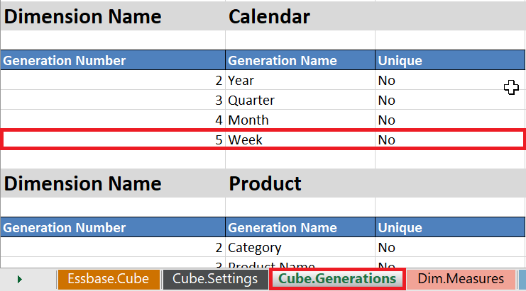
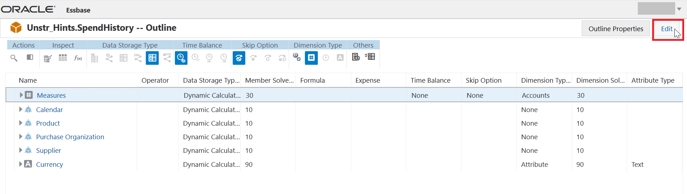
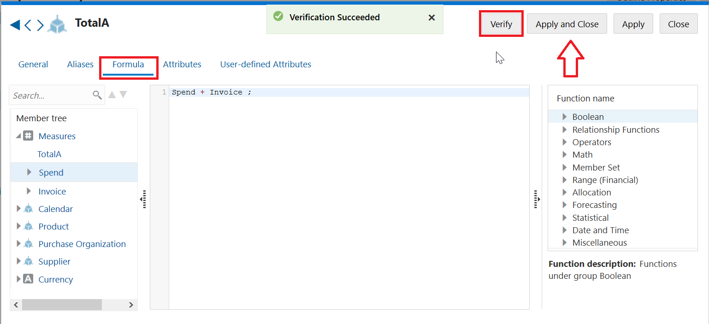
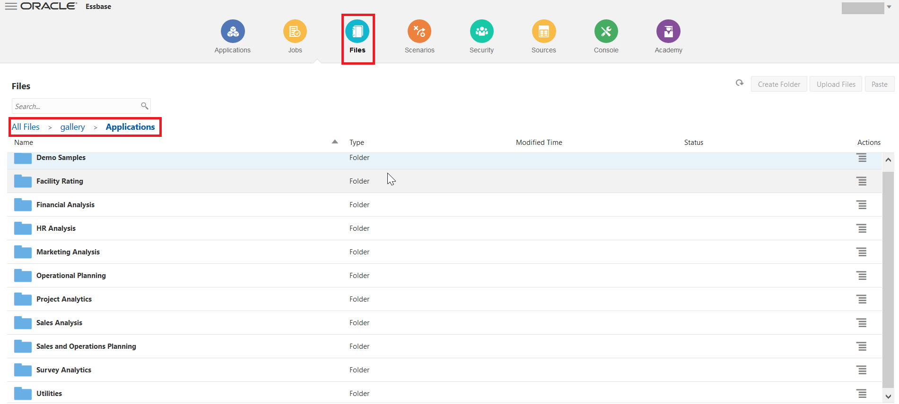
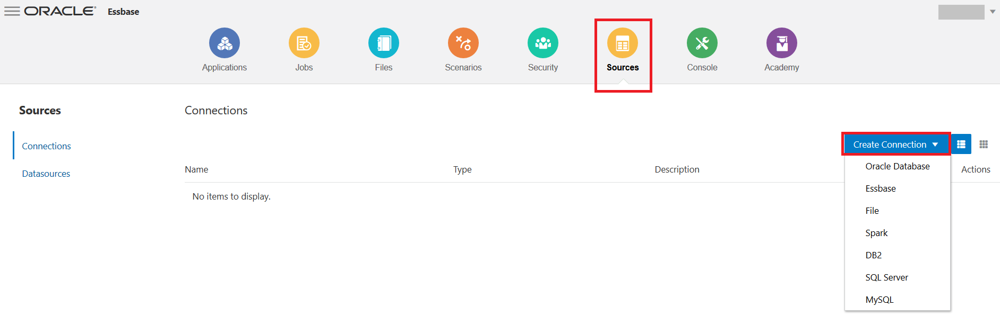
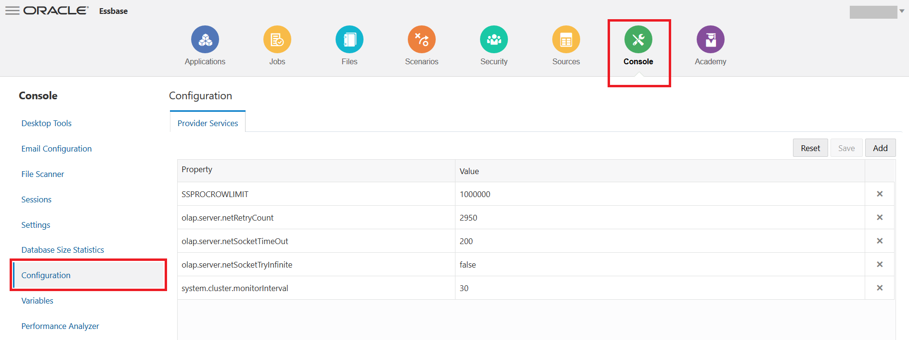

# Lab 14: Essbase Feature Functionalities

## Introduction

This lab walks you through the major features of Essbase-19c and their functionalities across the platform along with Overview of the Essbase 19c Web UI on the whole.

## Objectives

*	Understand the Essbase 19c Plugins. (Smartview and Cube designer)
*	Learn how to use the major aspects of plugins effectively.
*	Learn the Essbase 19c Web-UI overview.
*	Learn how to build rules/calculations and run corresponding jobs.
*	Learn the MIGRATION process between Cloud environments.
*	Understand the Essbase REST API functionality.

## Required Artifacts

*	The following lab requires an Oracle Public Cloud account - Essbase 19c Instance with Service Administrator role .
*	Windows Operating System is preferred for proper working of Essbase Plugins
*	The estimated time to complete this lab is 30 minutes. 

`NOTE: Whenever there is a “Name” being assigned to any Resource / Application / Cube or to any database in this lab please follow the naming convention as “Sample_<FIRST_NAME>” to avoid duplication.`

## Part 1 - Creating a Sample App in Essbase19c

1.	Login to the Essbase 19c UI using the corresponding Essbase endpoints. i.e. https://ip/essbase/jet

2.	Now in the Applications tab click on “Import” option from the UI as shown below.

3.	 From the pop-up window that’s displayed click on the “Catalog” as below.

4.	Now as mentioned in the path below , please select “Sample_Basic.xlsx” file. [ from Catalog -> All Files -> Gallery Templates ]

5.	Let us give the name of the Application as “DynamicCorp” and Cube i.e. Database name as “Sales” as below and then click OK.

6.	Now we can see an application is deployed and its status. 

This concludes the creation of sample app from the “Catalog” in the Essabase 19c UI.

## Part 2 - Analyzing Essbase data using Smart View Plugin

In this lab, we will be doing the following - 

* Connecting to Data Sources
* Describe Smart View user interface
* Create ad hoc grids
* Audit Trail

### Section 1 - Connecting to Data Sources 

After installing Oracle Smart View for Office, you can create connections to Essbase in cloud. Connections require information about the server and port. Your cloud service administrator should provide you with the information you need to create the connection. Use the quick connection method to create a private connection to 
the cloud service.

To create a private connection using the quick connection method:

1. In Excel, select the Smart View ribbon, and then click Panel.

2. On the Smart View Panel, click the arrow on the Switch to button, and then select Private Connections from the list.

3. In the text box that opens, enter the URL for the data source to which you want to connect. The URL syntax: `https://ip/essbase/smartview`

4. Click Go, or press Enter. (You will receive alert for certificate error. This is expected behavior as for the purpose of this tutorial we are using Essbase 19c deployment with demo certificate. Once in post deployment / production instance we replace demo certificate with paid SSL certificate we will not get this alert. For instance, click yes on alert to continue with lab exercise.)

5. On the login window, enter your login credentials. 

After successful login, you can now begin working with data in Oracle Analytics Cloud - Essbase. 

6. Expand ‘EssbaseCluster’, navigate to ‘DynamicCorp’ application. Double click on ‘Sales’ database.

You will be presented with option to create Ad hoc grid. Click on Ad hoc analysis.

### Section 2 - Describe Smart View user interface

**Smart View Ribbon**

The Smart View ribbon option enables you to set Smart View options and perform commands that are common for all data source providers.

**Essbase Ribbon**
The Essbase ribbon contains commands that enable you to view, navigate, and analyze Essbase data.

**POV Toolbar**
Dimensions that are not displayed in columns or rows of a data grid are displayed on POV toolbar, which identifies a slice of the database for a grid. For default ad hoc grids, all database dimensions are displayed on the POV toolbar at the dimension level

**Smart View Panel** 
You use Smart View panel to connect to your smart view data sources and manage connections.

### Section 3 - Create ad hoc grids

1. Bring up Excel. Click Smart View – Panel – Private Connections. Enter the provided Smart View URL. Supply the credentials.

2. In the Connection Manager panel to your right, click ‘DynamicCorp’ – ‘Sales’. Click Connect. Click Ad hoc Analysis. 

3. After connecting to an Essbase server and opening a worksheet, you can initiate ad hoc reports against databases on the connected server. A report initiated at the database level on an empty worksheet returns data from the top levels of each database dimension.

4. Double click or zoom in to Measures and Year. You will now see the measures broken down by Quarters.

5. Go to Year. Click on Zoom In – All levels. You will now see the numbers broken down to leaf level Months. ‘Zoom in’ drills down to display details. To zoom in on a member, perform one of the following actions:

        a. Select the member and then, on the Essbase ribbon, click Zoom In.
        b. Double-click the member.
        

6. Double Click (or Click Zoom in): Measures – Profit – Margins – Sales. Go to Sales. Click Keep Only. Now you are analyzing only Sales numbers and you have removed the rest from your sheet. 

7. In the Smart View ribbon click Undo. Undo reverses the last change you made to the data. 

8. In the Smart View ribbon click ‘Redo’. It will take you back to the sheet prior to the ‘Undo’. 

9. Pivot to POV: 

a. Click on ‘POV’ in ‘Essbase’ ribbon. 
        

b. Click on down arrow next to Market. Select New York. 
        

        
c. You can now select New York in the POV toolbar, click Refresh to see the figures refreshed in the sheet for New York. 

10. Member Selection: 

a. Drag Scenario from POV tool bar to the sheet. 

b. Click on Scenario

c. Click on Member Selection in the Essbase ribbon. Select Actual.

        
11. Free Form processing: 

a. You can free form type a member combination on a sheet. Click Refresh. The sheet will be updated to show the results of the query in your free form sheet. 

b. Start with creating smart view analysis report.

c. Create report by zooming into Year & Measures dimension.

12. You can directly enter Sales account member in place of Profit to visualize sales data across year without needing to perform member selection.

13. Click on Profit cell and replace with Sales, hit refresh.

### Secrtion 4 - Audit Trail

**Step 1 - Enable Audit trail:**

Data is updated in Essbase by Submitting data, adding/changing LRO (Linked Reporting Objects) and Data load. Essbase has the capability to let certain users go back and view the Audit Trail of the changes that were made to the data. 

Users who have one of the following roles on the application can view the processed audit records for the cubes in that application: Application Manager, Database manager, Database Update role. Only those records where the user name requesting the audit trail matches the user name registered in the audit records, will be returned. 

1. The Service Administrator and Power User have the permissions to enable Audit Trail in the Essbase Application. 
2. Log in to Essbase UI. Click on Application DynamicCorp. Click on hamburger icon. Click on inspect.

3. Click on configuration.
4. Click on Add + to your right.

5. Click + to select ‘AUDITTRAIL’ property.  Enter ‘DATA’ in value field. Click ‘Apply and Restart’ to restart application.

**Step 2 - Submit Data and Audit Trail**

1. Log in to Smart View and connect to application DynamicCorp/Sales. Click on Connect. Click on Ad hoc Analysis. 
2. Click on Year. Click on Zoom In – All levels. 
3. Change data for Jan. Click ‘Smart View’ – ‘Submit Data’
4. Click ‘More’ under ‘Ad hoc Analysis’. Click on ‘Audit Trail’.

5. Notice an Audit Trail table that contains records of changes made to the cube. The record contains Timestamp, New Value, Data cell POV where change was made. 
Below the table, notice a detailed description of the change in the Audit record.

 

**Step 3 - Linked Reporting Objects and Audit Trail**

1.	Click on cell cell B3. Click `Essbase` – `Linked Objects`. Click drop down next to `Attach`. Click `Cell Note`. Add a cell note "Figures are too high".
2.	Click on cell B7. Click `Essbase` – `Linked Objects`. Click drop down next to `Attach`. Click `File`. Browse and attach a file. Enter a file description. 
3.	Click on cell B11. `Essbase` – `Linked Objects`. Click drop down next to `Attach`. Click `URL`. Enter URL http://cnn.com and enter "Breaking news!". Make a few more such updates. 
4.	Click `Audit Trail` menu. You will see the table populated with all the changes you made. Each record in the audit trail represents one of two changes - change to data (New Value) or change to LRO (LRO)

**Step 4 - Audit Trail Table**

1.	There are three icons at the bottom of the audit table: "Export logs to sheet", "Refresh audit log list", "Adhoc for selected POV. The columns in the Audit trail table can be sorted by clicking the arrow at the heading. 

 

2.	Audit records can be exported to an excel file by clicking on icon at the bottom of Audit table called "Export logs to sheet". 

 

3.	When you click on an audit record, you can see the description of the audit record change in the description section at the bottom of the table.

 

4.	Then, if you want to do further analysis on the POV for this record, select the icon at the bottom of the Audit table titled "Adhoc for selected POV", it will land you on a sheet called "Audit_adhoc", with the POV and refreshed data value. This is the starting point and it is a live sheet where you can start doing analysis and rest of Smart View operations.  

 

5.	This is a shared sheet for landing from Audit record. When you click on subsequent audit records, and click on Adhoc for selected POV, it will land you in this same sheet.

## Part 3 - Install the Smart View Cube Designer Extension

Before you perform this procedure, you must complete the steps in Create Data Source Connections to Essbase. 

### Step 1 - Installing Cube Designer from Smart View

1. On the ‘Smart View’ ribbon, select ‘Options’, and then ‘Extensions’. 

 

2. Click the ‘Check for updates’ link. Smart View checks for all extensions that your administrator has made available to you.

 

3. Locate the extension named Oracle ‘Cube Designer’ and click ‘Install’ to start the installer. 
4. Follow the prompts to install the extension.

### Step 2 - Installing Cube Designer from Essbase

1. In Essbase19c UI , click ‘Console’.
2. On the ‘Desktop Tools’ tab, to the right of Cube Designer Extension, click ‘Download’. 

 

3. In the ‘CubeDesignerInstaller.svext’ dialog box, select ‘Save File’ and click ‘OK’. Save the file to a local directory.

 

4. Close all Microsoft Office applications and make sure Microsoft Office applications are not running in the background.
5. Double click the ‘CubeDesignerInstaller.svext’ file we downloaded to local directory.
6. Restart Microsoft Office applications.

### Step 3 - Update the Smart View Cube Designer Extension

If an extension is available for you to update, you can update it from Smart View Excel, on the Extensions tab of the Options dialog box. To check for Cube Designer Smart View extension updates and install them: 

1. From the ‘Smart View’ ribbon, select ‘Options’ and then ‘Extensions’.

 

2. Click the ‘Check for Updates, New Installs, and Uninstalls’ link to check for updates.

 

You are prompted to log in after you click on existing Essbase server URL’s.

If an update is available, the ‘Update Available’ icon is displayed in the Cube Designer row. 

*Note:*
This process uses a server locations list, which was created by previous Smart View connections . If there are connection definitions that are no longer valid, you receive errors when the process tries to connect to those servers. See [Delete Smart View Connection URLs](https://docs.oracle.com/en/cloud/paas/analytics-cloud/essug/delete-smart-view-connection-urls.html)

 

3.	Click Remove to uninstall the extension.
4.	Close Excel.
5.	Restart Excel.
6.	From the ‘Smart View’ ribbon, select ‘Options’ and then ‘Extensions’.
7.	Click ‘Check for Updates, New Installs, and Uninstalls’. Once again, when you select the Essbase URL, you are prompted to log in.
8.	In the Cube Designer row, click Install.
9.	Close Excel.
10.	Open Excel.
11.	Ensure that the Cube Designer ribbon is displayed in Excel. 

 

## Part 4 - About the Cube Designer Ribbon

Cube Designer helps you to design, create and modify application workbooks to meet their strict layout and syntax requirements. You can also use options on the Cube Designer ribbon to perform a number of cube management tasks, such as loading data, editing formulas and viewing jobs.

 

### Cube Designer Ribbon Options

**Connections:** Opens the ‘Connections’ dialog box, in which you choose the cloud service URL. 

**Essbase/Catalog:** Opens the Essbase Files dialog box, which contains a selection of prebuilt application workbooks, from which you can build sample applications and cubes. 

Also, a catalog toolbar is available in this dialog box from which you can perform many file operations within the catalog, such as upload, download, cut, copy, paste, delete, rename, and create a new folder.

**Local:** Provides a drop-down menu with options to open or save an application workbook locally, or to export a cube to an application workbook. 

**Designer Panel:** Opens the Designer Panel, a series of panels in which you can design and edit application workbooks. 

**Formula Editor:** Opens the Formula Editor, which provides an interface in which to develop member formulas, with assistance for developing correct syntax. 

**Hierarchy Viewer:** Opens the Dimension Hierarchy dialog box, in which you can view the hierarchy for the selected dimension worksheet in an application workbook, and perform tasks, such as renaming members and changing storage settings. See Work with Dimension Worksheets in Cube Designer. 

**Build Cube:** Opens the ‘Build Cube’ dialog box, where you can build a cube from the active application workbook. In this dialog box, cube designer automatically detects existing data and calculation worksheets, and then pre-selects options to load the data and run the worksheets. 

**Load Data:** Opens the Load Data dialog box, which contains options to clear all data and to load data. 

**Calculate:** Opens the Calculate Data dialog box, in which you can select an application, a cube, and a calculation script to execute. 

**Analyze:** Provides a drop-down menu with options to create a Smart View ad hoc grid, or connect application workbook query worksheets (Query.query_name worksheets) to Smart View. 

**View Jobs:** Opens the Job Viewer dialog box, in which you can monitor the status of jobs, such as data loads, calculations, imports, and exports. 

**Transform Data:** Opens the Transform Data dialog box, which lets you build a cube from tabular data. 

**Options:** Provides options to specify the default working folder and to activate the cube designer log. 

**Admin Tasks:** Opens a menu from which you can delete an application, delete a cube, or view logs. Selecting one of these options opens the ‘Delete Application’ or ‘Delete Cube’ dialog box, or allows you to view server or application logs. 

**Server name:** Shows the currently defined connection location. When you click ‘Server name’ and log in (if prompted to do so), the server name and the client and server versions are displayed.

## Part 5 - Creating a Cube from Tabular Data in Cube Designer 

This workflow uses two sample tabular data Excel files to demonstrate the concepts of intrinsic and forced-designation headers. See About [Using Tabular Data to Create Cubes](https://docs.oracle.com/en/cloud/paas/analytics-cloud/esugc/using-tabular-data-create-cubes.html)

1.	In Excel, on the ‘Cube Designer’ ribbon, click ‘Catalog’.

2.	On the Cloud Files dialog box, under Catalog, go to ‘gallery/Technical/Table Format’ as shown below, then select a sample tabular data file: `Unstr_Hints.xlsx: Intrinsic headers`

 

3.	Double click on the above directed file.

4.	On the `Cube Designer` ribbon, select `Transform Data`

5.	On the `Transform Data` dialog box, enter an application and cube name, if you want to change the default names that are prepopulated. 

 

The application name is based on the source file name without the extension and the cube name is based on the worksheet name.

`Unstr_Hints.xlsx: Application name is Unstr_Hints and the cube name is SpendHistory`

6.	Press `Preview Data` The workbook is sent to Essbase19c for analysis and the relationships are returned for viewing. 

7.	When you are ready to create the cube, click `Run`

8.	  (Optional) When asked if you want to see the cube job status, click `Yes`

 

The newly created application and cube are listed on the Applications home page in the cloud service and are available in Cube Designer. Now that the cube has been created from the tabular data, you can export the cube to an application workbook. 

9.	On the `Cube Designer` ribbon, select `Private / Local` , then select `Export Cube to Application Workbook`

 

10.	On the `Export Cube to Application Workbook` dialog box, select the application and cube, and then select `Run`

 

To create a cube in the cloud service, see Creating a Cube from Tabular Data. 

With this, we saw how a normal flat file excel sheet is converted into an Essbase Application and a Cube. We could get the DBX (Design by Example) file in a matter of seconds with the dynamic capabilities of Essbase powered by Cube Designer plugin.

## Part 6 - Updating Cubes Incrementally in Cube Designer

Updating a cube is how you load dimensions and members to a cube outline using a data source and a rules file. You can also use the cloud service to add dimensions and members manually. Here in an existing cube, you can update a dimension, or add a new one. 

*Note:* You cannot use Cube Designer to delete dimension in an existing cube. 

After making changes to the metadata such as adding a new dimension, members etc. in the Cube.Generations sheet.

        a. We will be adding a new member “Week” to the “Calendar” dimension.
        b. We will be adding a new dimension “Sales” with one member as “Measures”.
        
 

 

1. In Excel, on the Cube Designer ribbon, select Build Cube. 

 

Note : Before executing next step change the Application name & the Database name in the Essbase.Cube sheet of DBX file as below.
 
2. Choose `Update Cube – Retain all data` option from the Build Option menu and click RUN. 

When an outline is changed by a dimension build, the database may be restructured. Each of these options specifies how data values are handled during restructures:

**a. Update Cube - Retain All Data**
All data values are preserved.

**b. Update Cube - Retain Input Data**
All blocks (both upper-and lower-level) that contain loaded data are preserved. 

*Note:* This option applies only to block storage cubes. 

**c. Update Cube - Retain Leaf Data**
Only leaf (level 0) values are preserved. If all data is required for calculation resides in leaf members, then you should select this option. If selected, then all upper-level blocks are deleted before the cube is restructured. Therefore, the disk space required for restructuring is reduced, and calculation time is improved. When the cube is recalculated, the upper-level blocks are re-created.

**d. Update Cube - Remove All Data**
All data values are cleared. 

`Note: This option applies only to block storage cubes.`

`Note: Dimension build definitions are contained within the application workbook and automatically generate the necessary rules files. You do not select a rules file when building dimensions in Cube Designer.`

## Part 7 - Overview of the WEB-UI

### 1. Applications:
Applications tab gives us the information about the Essbase applications and the cubes built under them.

 

Here, we will also find options to explore the features available under each application & cube using the inspect option as below. The Application specific audit/logs, Application specific configuration files etc are available in the ‘Applications’ tab under ‘Inspect’ option.
as below.

 
 

We can access the outline of the cube and the specific files under it using the “Inspect” option as below on cube as well.

 
 

Outline Analysis : Outline option is equivalent to EAS console on Essbase on-prem, this is where we can add new dimensions or members under dimensions on any level as required and can make changes to existing cubes quickly using ‘Edit’ option. 
Select the ‘Outline’ option for the ‘SpendHistory’ cube. [ or any cube that is already LIVE on the Essbase 19c UI ].

 

Here, add a new child called ‘TotalA’ under ‘Measures’ dimension member as shown below. Let us now assign an ‘Ignore’ - ‘Consolidation operator’ to the ‘TotalA’ member. The operator defines the way in which the new member rolls up across the hierarchy.

 
 

We now have to add a formula to this new dimension using the pencil icon under the ‘formula’ tab as shown. We are adding ‘Spend’ and ‘Invoice’
Once added, we need to verify the formula and then select ‘Apply and Close’ .

 

We can also specify other options such as ‘Data storage’ type and ‘Sort/Inspect’ of members in a dimension using the options in UI. We can use ‘Skip’ option to skip missing values as below and ‘Save’ all the changes we made.

 

### 2. Jobs:
Jobs tab has all information about the jobs that are executed on Essbase UI. It is like an Audit of the tasks done on Essbase web-UI. 

Here we can create / run New jobs on applications and cubes using this tab as shown below.

 

Now we will execute a ‘Build Dimension’ job by selecting the application and cube as below, ‘Script’ file is the rule[.rul] file where the dimension build script exists , so let us select the pre-existing ‘DimBuild.rul’ file and its corresponding ‘DimensionsCSV.txt’ pair as the Data File and execute the job.

 

Once done, we can see the status of the job back in the UI and also the job details under actions across the job executed if needed .

 

### 3. Files:
 Files tab is equivalent to the file directory of Essbase, this is where we find all the files related to applications and cubes under “applications” folder.

 

In files tab we can upload the artifacts/files related to Essbase such as script files, rule files, load files etc existing on local systems directly into the cube of our choice using the ‘Upload Files’ option under the corresponding cube path. [ here in the image below application name is ‘Sample’ and cube name is ‘Basic’]

 

‘Gallery’ folder in ‘Files’ tab has industry wide sample templates in dbx format that are ready to use. They help us kickstart the process of building cubes related to that specific industry very quickly. 

 
 

### 4. Scenarios:
‘Scenarios’ tab is where we create scenario modeling on the applications for ‘What-If’ analysis, which empowers the users to analyze the data and get insights from the data. [ More on this will be covered in upcoming lab ]

### 5. Security:
‘Security’ tab holds the information about the users in Essbase and the role they are assigned. Here we can change the level of access assigned to a particular user.

We can add new users/groups by clicking on ‘Add Role’ option. 

 

### 6. Sources:
Many cube operations require connection information to access remote source data or hosts. You can define ‘Connections’ and ‘Datasources’ once and reuse them in various operations, so that you don’t have to specify the details each time you perform a task.
A connection stores login credentials required to access an external source. Essbase19c allows connections to following datasources shown below. A Datasource points to an external source of information.

 

### 7. Console:
Console tab is one stop place for Essbase Administrator tools such as 

* Export Utility : Command-Line tool for exporting the outline of a cube and other related elements into a DBX template.
* LCM : Life-Cycle Management tool is used for back-up and restoring the Essbase artifacts
* Command-Line Tool : CLI utility for Cloud Essbase platform
* Migration Utility :  This utility tool is used for migrating Essbase artifacts b/w Essbase instances and environments accordingly.
This tab also contains the download links for ‘Smartview’ & ‘Cube-Designer’ plugins. Extensions and Essbase Client tools such as MaxL, JAPI etc... under Desktop Tools section are also available

 

‘Console’ tab also holds the information regarding session login by users, settings of the Essbase environment, email configuration settings etc…
The ‘Global configuration’ file of Essbase is available directly from the Essbase Web-UI as shown, where we can add new variable property settings with corresponding values using ‘Add’ option.

 

 
### 8. Academy: 
This tab contains all the information and documentation links related to Essbase19c 

 

## Part 8 - Data Load to Cube
DataCorp IT group stores data in an Oracle Data warehouse that is being used to normalize the data. The IT group extracts data in flat files on a regular basis.
Loading data is the process of adding data values to a cube from any number of data sources or SQL database. Since data sources seldom are configured solely to support Essbase dimension build and data load processes, a rule file is generally used to create Essbase-compatible directives to be applied to the data source.

Create rules file that is based on sample file from the data warehouse.\

1.	Create rules file.
2.	Set the rules file to ignore extra fields.
3.	Define the data load properties.
4.	Validate and save the rules file as LoadCorp.
5.	Load data to Sales and specify the following options.

        a. Data Source: Data-Basic.txt
        b. Rules file: LoadCorp.rul

### Load Data Using a Rule File

1.	Open the downloaded data file, data-basic.txt, in a formatted text editor. Notice that there's no header row and that the file delimiter is a comma.
2.	Sign in to the Essbase web interface.
3.	On the home page, expand the DynamicCorp application, and select the Sales cube.
4.	Now create the load rule.

        a.	From the Actions menu to the right of the Sales cube, launch the inspector.
        b.	Select Scripts tab, and then Rules. The Rules editor is displayed, showing currently defined rules.
        c.	Click Create and select Data Load to define the load data rule.
        d.	In the New Rule dialog box, enter LoadCorp as the name of the rule.
        e.	Enter Measures as the data dimension.
        f.	Under Preview Data, select File for flat file input.
        g.	Click the browse icon to locate the file data-basic.txt that you downloaded, and click Open to select it.
        h.	As you saw earlier, the first row of the flat file doesn't contain header values. Deselect the Header Row check box if it is selected. When the header row is present, the columns are mapped automatically.
        i.	Select Comma as the Delimiter value, based on the file format.
        j.	Click Proceed.

5.	The Global options toolbar, on the top right of the Rules editor allows you to modify file properties or the data source and to see the results in the Rules editor. The Field options toolbar on the left side of the Rules editor allows you map fields in the rule.
6.	Because there were no headers in the input file, you need to map each column to the appropriate dimensions and members.
7.	In the Rules editor, you can now set up the rule fields.

        a.	Click Create drop-down menu, and start setting the field names.
        Set Field (column) 1 to Product.
        Set Field 2 to Market.
        Set Field 3 to Year.
        Set Field 4 to Scenario.
        Set Field 5 to Sales.
        Set Field 6 to COGS.
        Set Field 7 to Marketing.
        Set Field 8 to Payroll.
        Set Field 9 to Misc.
        Set Field 10 to Opening Inventory.
        Set Field 11 to Additions.
        All dimensions must be represented in the load data rule before any data can be loaded.
        b.	When you are finished defining the rule, with global and field options, click Verify on the Global toolbar to validate the syntax and click Close.
        c.	After syntax is validated, click Save and Close.
        d.	Click Refresh. See that your created rule is now listed in the Rules pane of the Scripts tab. You can edit your rule by clicking the rule name and then clicking Proceed.
        e.	Click Close to return to the Applications home page.

Next, create a job to load the data using the rule.

8.	On the home page, select Jobs, and then New Job.

        a.	Select Load Data.
        b.	In the Load Data dialog box, from the Application menu, select the DynamicCorp application.
        c.	In the Database list, select the Sales cube.
        d.	In the Script list, select the load data rule that you created, LoadCorp.rul.
        e.	For Load Type, select File.
        f.	Select the file Data-basic.txt from the Data File list. This file is located in the DataCorp > Sales folder.
        g.	Optional: select the Abort on error check box if you want the load to stop if an error occurs.
        h.	Click OK. The load data job is executed.
        i.	On the Jobs page, click Refresh to monitor the job status.
        
9.	After the job is completed, verify that the input records were processed and loaded.

        a.	On the Applications home page, click Actions to the right of the Sales cube in the DynamicCorp application.
        b.	Select Job Details to check the load data job details.
        c.	Click Close when done.
        d.	On the Applications home page again, open the Actions inspector for the Sample cube.
        e.	Select Statistics to view the resulting statistics for the Sales cube.

You have now completed loading data using a rule.
        
## Part 9 - Calculating Essbase Cube

A cube contains two types of values: values that you enter, called input data, and values that are calculated from input data.

A cube can be calculated using one of two methods. Outline calculation, which is the simplest calculation method, bases the calculation of a cube on the relationships between members in the cube outline and on any formulas that are associated with members in the outline.

A calculation script, which contains a series of calculation commands, equations, and formulas, allows you to define calculations other than those defined by the database outline.

You create calculation scripts using a script editor in the Essbase web interface.
Calculation scripts do not apply to aggregate storage applications.
1.	On the Application page, expand the application.
2.	From the Actions menu, to the right of the cube name, launch the inspector.
3.	Select the Scripts tab, and then select the Calculation Scripts tab.
4.	Click Add   to create a new calculation script.
5.	If member names are required in your calculation script, drill into the Member Tree to find the members you want to add.
Right-click dimension or member names to insert them into the script.
6.	If function names are required in your calculation script, use the Function Name menu to find calculation functions and add them to the script.
See the Function description under the menu to read descriptions of each function.
7.	The following calculation script, based on the DynamicCorp.Sales database, calculates the Actual values from the Year, Measures, Market, and Product dimensions:

FIX (Actual)
CALC DIM(Year, Measures, Market, Product);
ENDFIX

In the name field of script editor give the name to script as CalcActual

8.	Click Validate before saving your script.
Validating a script verifies the script syntax. For example, incorrectly spelled function names and omitted end-of-line semicolons are identified. Validation also verifies dimension names and member names.
9.	Correct any validation errors.
10.	Click Save.
11.	Click Close.

### Execute Calculations

After creating and saving calculation scripts, you use the Jobs page to execute them and perform the calculations on data loaded in your cube.
1.	Create your calculation script, or upload an existing calculation script.
2.	In Essbase, click Jobs.
3.	On the Jobs page, click New Job and select Run Calculation.
4.	On the Run Calculation dialog box, select the application - DynamicCorp and cube – Sales.
5.	Select the script – CalcActual.
6.	Click OK to start the calculation.
7.	Click Refresh to see the status of your calculation.

## Part 10 - Migration Utilities

### Import Essbase application using CLI:

This exercise will introduce how to automate tasks using OAC Essbase Command Line Interface.
* Import base cube using DBX structures sheet from CLI

Before you start, copy the provided file Sample_Basic.xlsx to your CLI directory.

The file Sample_Basic.xlsx will be imported using CLI and form the starting point for the rest of the exercise   

1. Next deploy the the Sample cube using the Sample_Basic.xlsx file.  Call the application Sample01
Command:  esscs.bat deploy --help
Command:  esscs.bat deploy -a Sample01 -db Basic -file Sample_Basic.xlsx

2. Next, review the newly create cube from the Web UI.

### LcmExport: Back Up Cube Files:

LcmExport CLI command backs up cube artifacts to a Lifecycle Management (LCM) .zip file. 
To export Sample application deployed in last step use command.
Syntax:
lcmExport [-verbose] -application appname [-zipfilename filename] [-localDirectory path] [-threads threadscount] [-skipdata] [-overwrite] [-generateartifactlist] [-include-server-level]
esscs lcmExport -application Sample -zipfilename Sample.zip

### LcmImport: Restore Cube Files

Restores cube artifacts from a Lifecycle Management (LCM) .zip file. 
Syntax : lcmImport [-verbose] -zipfilename filename [-overwrite] [-targetappName targetApplicationName] [-artifactlist artifactList]
Command example : esscs lcmImport -z  C:/cli/Sample.zip -o

*NOTE:* The mentioned path should not contain spaces.

## Part 11 - REST APIs

Using the REST API for Oracle Essbase enables you to automate management of Essbase resources and operations. All requests and responses are communicated over secured HTTP.

You can view a list of all REST Endpoints.
Explore the Swagger Interface
The Swagger interface for Essbase REST enables you to try out REST requests in a visual interface, even before you have set up cURL or another API implementation method.
To use the Swagger interface,
1.	In a web browser, enter the URL for the Essbase web interface. 
For example: https://ip/essbase/jet
2.	Log in.
3.	In your browser address bar, select all of the URL string that immediately follows essbase, and replace it with /rest/doc/. 
For example, change the URL to:  https://ip/essbase/rest/doc/
4.	On Swagger UI, you will be presented with number of different REST APIs.  
Download Application Logs using REST APIs –
1.	Under Application logs, click on the second GET button (Download All Logs).
 

 

2.	Click the Try it Out button.

 

3.	Enter the name of application. 

 

4.	Click the Execute button.

5.	Look under the Server Response section. If the request was successful, then you should see a 200 response with a body such as the following:

 

6.	Click on the Download File link to download zip file containing application log.

You can integrate REST APIs with cURL in order to automate various Essbase tasks. cURL is a command-line data transfer tool you can use for making HTTP requests and other requests.
