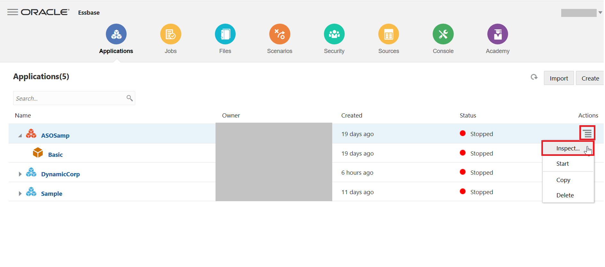
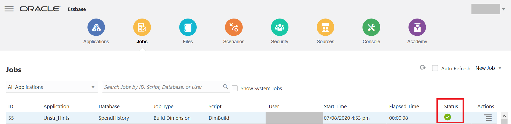
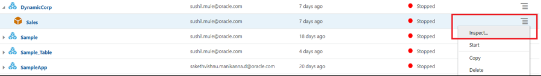

# Lab 14: Essbase Features 

## Introduction

This lab walks you through the major features of Essbase-19c and their functionalities across the platform along with Overview of the Essbase 19c Web interface.

## Objectives

*	Understand the Essbase 19.3 Plugins (Smart View and Cube designer)
*	Understand the 19.3 Web-UI overview.
*	Learn how to build rules/calculations and run corresponding jobs.
*	Learn the migration process between Cloud environments.
*	Understand the Essbase REST API functionality.

## Required Artifacts

This lab requires 

*       An Oracle Public Cloud account-Essbase 19.3 instance
*	Service administrator role
*	Windows Operating System for Essbase add-ins (Smart View and Cube Designer)

`NOTE: Whenever there is a “Name” being assigned to any Resource / Application / Cube or to any database in this lab please follow the naming convention as “Sample_<FIRST_NAME>” to avoid duplication.`

## Part 1 - Creating a Sample App in Essbase19c

1.	Login to the Essbase 19.3 web interface  using the corresponding Essbase endpoints. i.e. https://ip/essbase/jet

2.	On the Applications tab click on “Import” option from the UI as shown below.

3.	 From the Import dialog box, click Catalog.

4.	Select “Sample_Basic.xlsx” file  from Catalog -> All Files -> Gallery Templates. 

5.	Name the application “DynamicCorp,” and name the cube (database) “Sales” and click OK.

6.	Now we can see an application is deployed and its status. 

This concludes the creation of sample application from the “Catalog” in the Essabase 19.3 User Interface.

## Part 2 - Analyzing Essbase data using Smart View Add-ins

In this section, we will be doing the following - 

* Connect to Data Sources
* Explore the Smart View interface
* Create ad hoc grids
* Use Audit Trail

### Section 1 - Connecting to Data Sources 

After installing Oracle Smart View for Office, you can create connections to Essbase. Connections require information about the server and port. Your administrator should provide you with the information you need to create the connection. Use the quick connection method to create a private connection to 
Essbase.

To create a private connection using the quick connection method:

1. In Excel, select the Smart View ribbon, and then click Panel.

2. On the Smart View Panel, click the arrow on the Switch to button, and then select Private Connections from the list.

3. In the text box that opens, enter the URL for the data source to which you want to connect. The URL syntax: `https://ip/essbase/smartview`

4. Click Go, or press Enter. (You will receive alert for certificate error. This is expected behavior as for the purpose of this tutorial we are using an Essbase 19.3 deployment with a demo certificate. Once you're in a post deployment / production instance we replace the demo certificate with a paid SSL certificate and you wont get this alert. For instance, click yes on the alert to continue with this lab exercise.)

5. On the login window, enter your login credentials. 

After successful login, you can now begin working with data in Essbase. 

6. Expand ‘EssbaseCluster,’ navigate to the ‘DynamicCorp’ application. Double click on the ‘Sales’ database.

You will be presented with the option to create ad hoc grid. Click Ad hoc analysis.

### Section 2 - Describe Smart View user interface

**Smart View Ribbon**

The Smart View ribbon option enables you to set Smart View options and perform commands that are common for all data source providers.

**Essbase Ribbon**
The Essbase ribbon contains commands that enable you to view, navigate, and analyze Essbase data.

**POV Toolbar**
Dimensions that are not displayed in columns or rows of a data grid are displayed on POV toolbar, which identifies a slice of the database for a grid. For default ad hoc grids, all database dimensions are displayed on the POV toolbar at the dimension level

**Smart View Panel** 
You use Smart View panel to connect to your smart view data sources and manage connections.

### Section 3 - Create ad hoc grids

1. Bring up Excel. Click Smart View – Panel – Private Connections. Enter the provided Smart View URL. Supply the credentials.

2. In the Connection Manager panel to your right, click ‘DynamicCorp’ – ‘Sales’. Click Connect. Click Ad hoc analysis. 

3. After connecting to an Essbase server and opening a worksheet, you can initiate ad hoc reports against databases on the connected server. A report initiated at the database level on an empty worksheet returns data from the top levels of each database dimension.

4. Double click or zoom in to Measures and Year. You will now see the measures broken down by Quarters.

5. Go to Year. Click on Zoom in – All levels. You will now see the numbers broken down to leaf level Months. ‘Zoom in’ drills down to display details. To zoom in on a member, perform one of the following actions:

        a. Select the member and then, on the Essbase ribbon, click Zoom In.
        b. Double-click the member.
        

6. Double Click (or Click Zoom in): Measures – Profit – Margins – Sales. Go to Sales. Click Keep Only. Now you are analyzing only Sales numbers and you have removed the rest from your sheet. 

7. In the Smart View ribbon click Undo. Undo reverses the last change you made to the data. 

8. In the Smart View ribbon click ‘Redo’. It will take you back to the sheet prior to the ‘Undo’. 

9. Pivot to POV: 

a. Click on ‘POV’ in ‘Essbase’ ribbon. 
        

b. Click the down arrow next to Market. Select New York. 
        

        
c. Select New York in the POV toolbar, and click Refresh to see the figures refreshed in the sheet for New York. 

10. Member Selection: 

a. Drag Scenario from POV tool bar to the sheet. 

b. Click on Scenario

c. Click on Member Selection in the Essbase ribbon. Select Actual.

        
11. Free Form processing: 

a. You can free form type a member combination on a sheet. Click Refresh. The sheet will be updated to show the results of the query in your free form sheet. 

b. Start by creating smart view analysis report.

c. Create report by zooming into the Year & Measures dimension.

12. You can directly enter Sales account member in place of Profit to visualize sales data across year without needing to perform member selection.

13. Click the Profit cell, replace with Sales, hit and select refresh.

## Part 3 - Install the Smart View Cube Designer Extension

Before you perform this procedure, you must complete the steps in Create Data Source Connections to Essbase. 

### Step 1 - Installing Cube Designer from Smart View

1. On the ‘Smart View’ ribbon, select ‘Options’, and then ‘Extensions’. 

 

2. Click the ‘Check for updates’ link. Smart View checks for all extensions that your administrator has made available to you.

 

3. Locate the extension named Oracle ‘Cube Designer’ and click ‘Install’ to start the installer. 
4. Follow the prompts to install the extension.

### Step 2 - Installing Cube Designer from Essbase

1. In Essbase 19.3 web interface , click ‘Console’.
2. On the ‘Desktop Tools’ tab, to the right of Cube Designer Extension, click ‘Download’. 

 

3. In the ‘CubeDesignerInstaller.svext’ dialog box, select ‘Save File’ and click ‘OK’. Save the file to a local directory.

 

4. Close all Microsoft Office applications and make sure Microsoft Office applications are not running in the background.
5. Double click the ‘CubeDesignerInstaller.svext’ file we downloaded to local directory.
6. Restart Microsoft Office applications.

## Part 4 - Creating a Cube from Tabular Data in Cube Designer 

This workflow uses two sample tabular data Excel files to demonstrate the concepts of intrinsic and forced-designation headers. See About [Using Tabular Data to Create Cubes](https://docs.oracle.com/en/cloud/paas/analytics-cloud/esugc/using-tabular-data-create-cubes.html)

1.	In Excel, on the ‘Cube Designer’ ribbon, click ‘Catalog’.

2.	On the Cloud Files dialog box, under Catalog, go to ‘gallery/Technical/Table Format’ as shown below, then select a sample tabular data file: `Unstr_Hints.xlsx: Intrinsic headers`

 

3.	Double click on the above directed file.

4.	On the `Cube Designer` ribbon, select `Transform Data`

5.	On the `Transform Data` dialog box, enter an application and cube name, if you want to change the default names that are prepopulated. 

 

The application name is based on the source file name without the extension and the cube name is based on the worksheet name.

`Unstr_Hints.xlsx: Application name is Unstr_Hints and the cube name is SpendHistory`

6.	Click `Preview Data` The workbook is sent to Essbase 19.3 for analysis and the relationships are returned for viewing. 

7.	When you are ready to create the cube, click `Run`

8.	  (Optional) When asked if you want to see the cube job status, click `Yes`

 

The newly created application and cube are listed on the Applications home page in the cloud service and are available in Cube Designer. Now that the cube has been created from the tabular data, you can export the cube to an application workbook. 

9.	On the `Cube Designer` ribbon, select `Private / Local` , then select `Export Cube to Application Workbook`

 

10.	On the `Export Cube to Application Workbook` dialog box, select the application and cube, and then select `Run`

 
To create a cube in Essbase the cloud service, see Creating a Cube from Tabular Data. 

In this exercise, you saw how a normal flat file Excel sheet can be converted into an Essbase application and a cube. You could get the application workbook DBX (Design by Example) file in a matter of seconds with the dynamic capabilities of Essbase powered by the Cube Designer add-ins.

## Part 5 - Overview of the WEB-User Interface

### 1. Applications:
Applications tab gives us the information about the Essbase applications and the cubes built under them.

 

Here, we will also find options to explore the features available under each application & cube using the inspect option as below. The Application specific audit/logs, Application specific configuration files etc are available in the ‘Applications’ tab under ‘Inspect’ option.

By choosing the Inspect option for each application, you can see application specific logs, audit files, configuration files, etc.

 
 

You can access outlines and specific cube options by choosing the Inspect menu item for each cube.

 
 

Outline Analysis: The Outline option is equivalent to the EAS console on in Essbase on-premises. This is where you can add new dimensions or members under dimensions on at any level, as required, and can make changes to existing cubes quickly using the ‘Edit’ option. Select the ‘Outline’ option for the ‘SpendHistory’ cube. [or any cube that is already LIVE on the Essbase 19.3 web interface ].

 

Here, add a new child called ‘TotalA’ under the ‘Measures’ dimension member as shown below. Let us now assign an ‘Ignore’ Consolidation operator to the ‘TotalA’ member. The operator defines the way in which the new member rolls up across the hierarchy.

 
 

We now have to add a formula to this new dimension using the pencil icon under the ‘formula’ tab as shown. We are adding ‘Spend’ and ‘Invoice’
Once added, we need to verify the formula and then select Apply and Close.

 

You can also specify other options such as Data storage type and ‘Sort/Inspect’ of members in a dimension using the options in the web interface. You can use the ‘Skip’ option to skip missing values as shown below. Save all the changes you made.

 

### 2. Jobs:

The Jobs tab displays all the information about the jobs that have been executed on in the Essbase web interface. The display of Jobs serves as an Audit of all the tasks done on the Essbase web interface. 
You can create and run new jobs on applications and cubes using this tab, as shown below.

 

Execute a Build Dimension job by selecting the application and cube, as shown below. The ‘Script’ file is the rule[.rul] file where the dimension build script exists. Select the pre-existing ‘DimBuild.rul’ file and its corresponding ‘DimensionsCSV.txt’ pair as the Data File and execute the job.

 

Once the job is running, you can see the status of the job in the Essbase web interface. You can view the job details under Actions  for the job executed.

 

### 3. Files:

The Files tab is equivalent to the file directory of Essbase. This is where you find all the files related to applications and cubes under the “applications” folder.

 

On the Files tab you can upload the artifacts/files related to Essbase, such as script files, rule files, load files etc. existing on local systems directly into the cube of our choice using the ‘Upload Files’ option under the corresponding cube path. [In the image below, the application name is ‘Sample’ and the cube name is ‘Basic’]

 

The ‘Gallery’ folder on the ‘Files’ tab has industry wide sample templates in dbx format that are ready to use. They help you kickstart the process of building cubes related to that specific industry very quickly. 

 
 

### 4. Scenarios:

The ‘Scenarios’ tab is where you create scenario modeling on the applications for ‘What-If’ analysis, which empowers the users to analyze the data and get insights from the data. [More on this will be covered in an upcoming lab. ]

### 5. Security:

The ‘Security’ tab holds the information about the users in Essbase and the roles they’re assigned. You can change the level of access assigned to a particular user.
You can add new users/groups by clicking on the ‘Add Role’ option. 

 

### 6. Sources:

Many cube operations require connection information to access remote source data or hosts. You can define ‘Connections’ and ‘Datasources’ once and reuse them in various operations, so that you don’t have to specify the details each time you perform a task. A connection stores login credentials required to access an external source. Essbase 19c allows connections to the Datasources shown below. A Datasource points to an external source of information.

 

### 7. Console:

The Console tab is one stop place for Essbase Administrator tools such as: 
*	Export Utility: Command-Line tool for exporting the outline of a cube and other related elements into a DBX template an application workbook.
*	LCM: Life-Cycle Management tool is used for backing up and restoring the Essbase artifacts
*	Command-Line Tool: CLI utility for Cloud Essbase platform
*	Migration Utility: This utility is used for migrating Essbase artifacts  between Essbase instances and environments. This tab also contains the download links for Smart View and Cube Designer add-ins. Extensions and Essbase Client tools such as MaxL, Java API, and othersnder are also available in the Desktop Tools section.

 

‘Console’ tab also holds the information regarding session login by users, settings of the Essbase environment, email configuration settings etc…
The ‘Global configuration’ file of Essbase is available directly from the Essbase Web-user interface as shown, where we can add new variable property settings with corresponding values using ‘Add’ option.

 

 
### 8. Academy: 
This tab contains all the information and documentation links related to Essbase 19.3 

 

## Part 6 - Data Load to Cube
DataCorp IT group stores data in an Oracle Data warehouse that is being used to normalize the data. The IT group extracts data in flat files on a regular basis.
Loading data is the process of adding data values to a cube from any number of data sources or SQL database. Since data sources seldom are configured solely to support Essbase dimension build and data load processes, a rule file is generally used to create Essbase-compatible directives to be applied to the data source.

Create a rule file that is based on sample file from the data warehouse.\

1.	Create rules file.

 

2.	Set the rule file to ignore extra fields.
3.	Define the data load properties.
4.	Validate and save the rule file as LoadCorp.
5.	Load data to Sales and specify the following options.

        a. Data Source: Data-Basic.txt
        b. Rules file: LoadCorp.rul

### Load Data Using a Rule File

1.	Open the downloaded data file, data-basic.txt, in a formatted text editor. Notice that there's no header row and that the file delimiter is a comma.
2.	Sign in to the Essbase web interface.
3.	On the home page, expand the DynamicCorp application, and select the Sales cube.
4.	Now create the load rule.

      a.	From the Actions menu to the right of the Sales cube, launch the inspector.
      
       
      
      b.	Select the Scripts tab, and then Rules. The Rules editor is displayed, showing currently defined rules.
      c.	Click Create and select Data Load to define the load data rule.
      
       
      
      d.	In the New Rule dialog box, enter LoadCorp as the name of the rule.
      e.	Enter Measures as the data dimension.
      f.	Under Preview Data, select File for flat file input.
      g.	Click the browse icon to locate the file data-basic.txt that you downloaded, and click Open to select it.
      h.	As you saw earlier, the first row of the flat file doesn't contain header values. Deselect the Header Row check box if it is selected. When the header row is present, the columns are mapped automatically.
      i.	Select Comma as the Delimiter value, based on the file format.
      j.	Click Proceed.
      
       
      
      You can now see the preview of the data in the Rules editor, based on the input flat file.
      
      

5.	The Global options toolbar, on the top right of the Rules editor allows you to modify file properties or the data source and to see the results in the Rules editor. The Field options toolbar on the left side of the Rules editor allows you map fields in the rule.
6.	Because there were no headers in the input file, you need to map each column to the appropriate dimensions and members.
7.	In the Rules editor, you can now set up the rule fields.

 

        a. Click Create drop-down menu, and start setting the field names.
        Set Field (column) 1 to Product.
        Set Field 2 to Market.
        Set Field 3 to Year.
        Set Field 4 to Scenario.
        Set Field 5 to Sales.
        Set Field 6 to COGS.
        Set Field 7 to Marketing.
        Set Field 8 to Payroll.
        Set Field 9 to Misc.
        Set Field 10 to Opening Inventory.
        Set Field 11 to Additions.
        All dimensions must be represented in the load data rule before any data can be loaded.
        b. When you are finished defining the rule, with global and field options, click Verify on the Global toolbar to validate the syntax and click Close.
        c. After syntax is validated, click Save and Close.
        d. Click Refresh. See that your created rule is now listed in the Rules pane of the Scripts tab. You can edit your rule by clicking the rule name and then clicking Proceed.
        e. Click Close to return to the Applications home page.

Next, create a job to load the data using the rule.

8.	On the home page, select Jobs, and then New Job.

      a. Select Load Data.
      b. In the Load Data dialog box, from the Application menu, select the DynamicCorp application.
      c. In the Database list, select the Sales cube.
      d. In the Script list, select the load data rule that you created, LoadCorp.rul.
      e. For Load Type, select File.
      f. Select the file Data-basic.txt from the Data File list. This file is located in the DataCorp > Sales folder.
      g. Optional: select the Abort on error check box if you want the load to stop if an error occurs.
      h. Click OK. The load data job is executed.
        
     
        
      i. On the Jobs page, click Refresh to monitor the job status.
      
      
        
9.	After the job is completed, verify that the input records were processed and loaded.

        a.	On the Applications home page, click Actions to the right of the Sales cube in the DynamicCorp application.
        b.	Select Job Details to check the load data job details.
        c.	Click Close when done.
        d.	On the Applications page, click the Actions menu on the cube row to the right of the Sample cube, and click Inspect.
        e.	Select Statistics to view the resulting statistics for the Sales cube.

You have now completed loading data using a rule.
        
## Part 7 - Calculating Essbase Cube

A cube contains two types of values: values that you enter, called input data, and values that are calculated from input data.

A cube can be calculated using one of two methods. Outline calculation, which is the simplest calculation method, bases the calculation of a cube on the relationships between members in the cube outline and on any formulas that are associated with members in the outline.

A calculation script, which contains a series of calculation commands, equations, and formulas, allows you to define calculations other than those defined by the database outline.

You create calculation scripts using a script editor in the Essbase web interface.
Calculation scripts do not apply to aggregate storage applications.
1.	On the Application page, expand the application.
2.	From the Actions menu, to the right of the cube name, launch the inspector.

3.	Select the Scripts tab, and then select the Calculation Scripts tab.

4.	Click Add   to create a new calculation script.
5.	If member names are required in your calculation script, drill into the Member Tree to find the members you want to add.
Right-click dimension or member names to insert them into the script.
6.	If function names are required in your calculation script, use the Function Name menu to find calculation functions and add them to the script.
See the Function description under the menu to read descriptions of each function.
7.	The following calculation script, based on the DynamicCorp.Sales database, calculates the Actual values from the Year, Measures, Market, and Product dimensions:

FIX (Actual)
CALC DIM(Year, Measures, Market, Product);
ENDFIX

In the name field of script editor give the name to script as CalcActual

8.	Click Validate before saving your script.
Validating a script verifies the script syntax. For example, incorrectly spelled function names and omitted end-of-line semicolons are identified. Validation also verifies dimension names and member names.
9.	Correct any validation errors.
10.	Click Save.
11.	Click Close.

### Execute Calculations

After creating and saving calculation scripts, you use the Jobs page to execute them and perform the calculations on data loaded in your cube.
1.	Create your calculation script, or upload an existing calculation script.
2.	In Essbase, click Jobs.
3.	On the Jobs page, click New Job and select Run Calculation.

4.	On the Run Calculation dialog box, select the application - DynamicCorp and cube – Sales.
5.	Select the script – CalcActual.

6.	Click OK to start the calculation.
7.	Click Refresh to see the status of your calculation.

## Part 8 - Migration Utilities

### Import Essbase application using CLI:

This exercise will introduce how to automate tasks using Essbase Command Line Interface.
* Import base cube using Application Workbook structures sheet from CLI

Before you start, copy the provided file Sample_Basic.xlsx to your CLI directory.

The file Sample_Basic.xlsx will be imported using CLI and form the starting point for the rest of the exercise   

1. Next deploy the the Sample cube using the Sample_Basic.xlsx file.  Call the application Sample01
Command:  esscs.bat deploy --help
Command:  esscs.bat deploy -a Sample01 -db Basic -file Sample_Basic.xlsx

2. Next, review the newly create cube from the Essbase Web Interface.

### LcmExport: Back Up Cube Files:

* The LcmExport CLI command backs up cube artifacts to a Lifecycle Management (LCM) .zip file. 
* To export Sample application deployed in last step use command.

**Syntax:**

`lcmExport [-verbose] -application appname [-zipfilename filename] [-localDirectory path] [-threads threadscount] [-skipdata] [-overwrite] [-generateartifactlist] [-include-server-level]
esscs lcmExport -application Sample -zipfilename Sample.zip`

### LcmImport: Restore Cube Files

* Restores cube artifacts from a Lifecycle Management (LCM) .zip file. 

**Syntax:**

`lcmImport [-verbose] -zipfilename filename [-overwrite] [-targetappName targetApplicationName] [-artifactlist artifactList]
Command example : esscs lcmImport -z  C:/cli/Sample.zip -o`

*NOTE:* The mentioned path should not contain spaces.

## Part 9 - REST APIs

Using the REST API for Oracle Essbase enables you to automate management of Essbase resources and operations. All requests and responses are communicated over secured HTTP.

You can view a list of all REST Endpoints.

**Explore the Swagger Interface**

The Swagger interface for Essbase REST enables you to try out REST requests in a visual interface, even before you have set up cURL or another API implementation method.
To use the Swagger interface,

1. In a web browser, enter the URL for the Essbase web interface. 
For example: https://ip/essbase/jet
2. Log in.
3. In your browser address bar, select all of the URL string that immediately follows essbase, and replace it with /rest/doc/. 

`For example, change the URL to:  https://ip/essbase/rest/doc/`

4. On Swagger UI, you will be presented with number of different REST APIs.  

**Download Application Logs using REST APIs –**

1.	Under Application logs, click on the second GET button (Download All Logs).

2.	Click the Try it Out button.

3.	Enter the name of application. 

4.	Click the Execute button.

5.	Look under the Server Response section. If the request was successful, then you should see a 200 response with a body such as the following:

6.	Click on the Download File link to download zip file containing application log.

You can integrate REST APIs with cURL in order to automate various Essbase tasks. cURL is a command-line data transfer tool you can use for making HTTP requests and other requests.
